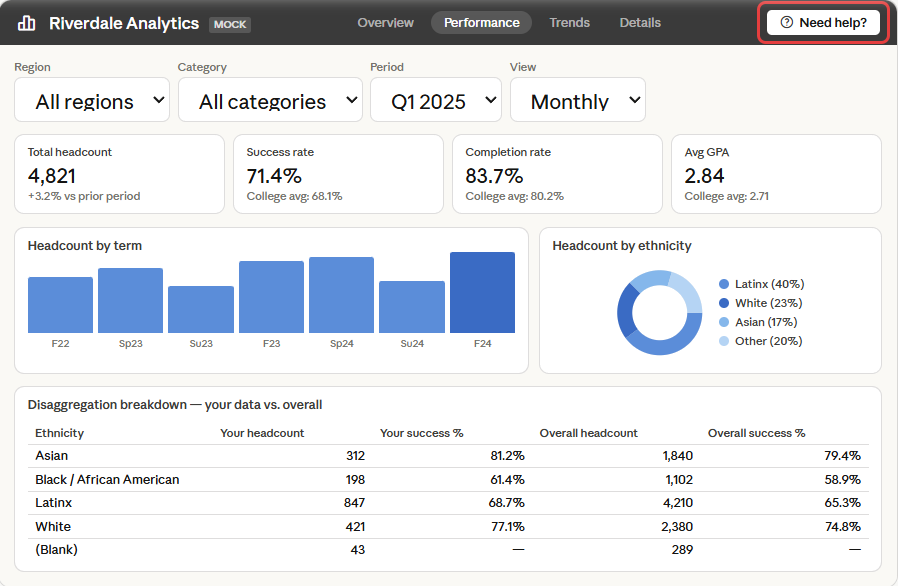
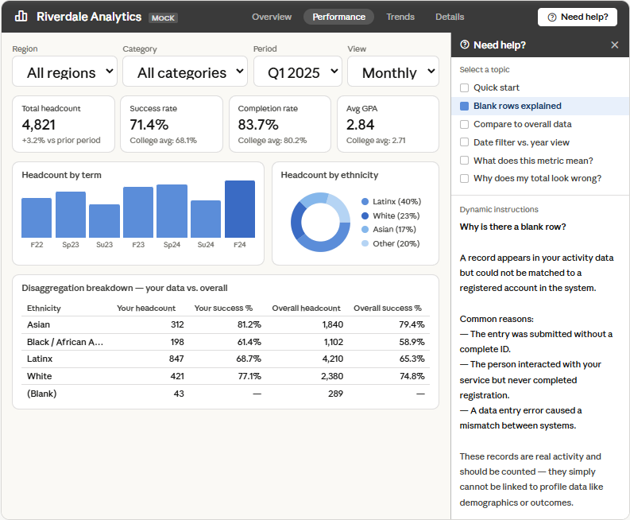

# Power BI — dynamic in-dashboard help panel with DAX

A DAX pattern for building what I call a pseudo chatbot inside Power BI. Users click a button, a panel slides open, they select a topic, and the answer appears instantly — no PDFs, no external documentation, no leaving the dashboard. No AI involved — just DAX, a slicer, and a card visual.

> I built this because users kept asking the same questions about my dashboards. This solved it without any external tools. I'm not a Power BI expert — if you see improvements, open an issue.

> **Note:** The topics and answers included in the code are generic examples only. Replace them with questions and answers relevant to your own dashboard and your own users. The pattern is the reusable part — the content is entirely yours to define.

---

## The problem

Users struggle to understand dashboards without documentation. PDFs get ignored, Notes pages go unread, and support requests pile up for questions that could be answered in seconds. There is no built-in Power BI component for contextual, self-serve help inside a report.

---

## What this builds

A help panel that lives inside the report, attached to a small button. When closed it takes up zero space. When open it shows a slicer of topics and a text card with the answer.

**Panel hidden — button always visible:**



**Panel open — user has selected a topic:**



---

## Why this beats a PDF

| | PDF / Notes page | This pattern |
|---|---|---|
| User has to leave the dashboard | Yes | No |
| Topics are discoverable at a glance | No | Yes |
| Updating content requires republishing | Sometimes | Yes, but it's one measure |
| Works on any page | No | Yes |

---

## Requirements

- Power BI Desktop and Power BI Service
- No additional data sources or permission lists needed — this pattern is fully self-contained

---

## Setup

### Part 1 — DAX

1. Create the `Instruction Types` calculated table
2. Create the `Dynamic Instructions` measure
3. Add a slicer to your page fed by the `InstructionType` column from the table
4. Sort the slicer by the `SortOrder` column
5. Add a Card visual and assign `Dynamic Instructions` as its field
6. Size the card generously — answers can be long

### Part 2 — Bookmark toggle (show/hide button)

1. Select both the slicer and the card, group them via Format → Group
2. Open the Bookmarks pane (View → Bookmarks)
3. Hide the group and save a bookmark called `Help_Hidden`
4. Show the group and save a bookmark called `Help_Visible`
5. For both bookmarks: right-click → edit → uncheck "Data" and "Current page"
6. Add a small "?" button on the page — set its Action to Bookmark → `Help_Visible`
7. Add an "X" button inside the group — set its Action to Bookmark → `Help_Hidden`
8. Publish — users hold Ctrl and click to trigger bookmarks in the Service

---

## The code

### `Instruction Types` — calculated table
Creates the slicer options. Add or remove rows to change available topics.

```dax
Instruction Types = 
VAR BaseTable = DATATABLE(
    "InstructionType", STRING,
    {
        {"Quick start"},
        {"Blank rows explained"},
        {"Compare to overall data"},
        {"Date filter vs. year view"},
        {"What does this metric mean?"},
        {"Why does my total look wrong?"}
    }
)
RETURN
ADDCOLUMNS(
    BaseTable,
    "SortOrder", SWITCH(
        [InstructionType],
        "Quick start", 1,
        "Blank rows explained", 2,
        "Compare to overall data", 3,
        "Date filter vs. year view", 4,
        "What does this metric mean?", 5,
        "Why does my total look wrong?", 6
    )
)
```

---

### `Dynamic Instructions` — measure

> **This is where your content goes.** The topics and answers below are generic examples to show you the structure. Replace every `SWITCH` branch with your own questions and explanations. Add as many branches as you need — one per topic in your `Instruction Types` table.

Returns help text based on the slicer selection. Replace the content inside each `SWITCH` branch with your own explanations.

```dax
Dynamic Instructions = 
VAR SelectedType = SELECTEDVALUE(
    'Instruction Types'[InstructionType],
    "Quick start"
)
RETURN
SWITCH(
    SelectedType,

    "Quick start",
        "QUICK START" & UNICHAR(10) & UNICHAR(10) &
        "1. Select a metric from the Metric Selection box." & UNICHAR(10) & UNICHAR(10) &
        "2. Choose how to break down your data using the Disaggregation filter." & UNICHAR(10) & UNICHAR(10) &
        "3. Select a term or academic year from the date filter." & UNICHAR(10) & UNICHAR(10) &
        "4. Your data will update automatically." & UNICHAR(10) & UNICHAR(10) &
        "5. Use the bottom table to compare your data against the overall totals.",

    "Blank rows explained",
        "WHY IS THERE A BLANK ROW?" & UNICHAR(10) & UNICHAR(10) &
        "A record appears in your activity data but could not be matched" & UNICHAR(10) &
        "to a registered account in the system." & UNICHAR(10) & UNICHAR(10) &
        "Common reasons:" & UNICHAR(10) &
        "  - The entry was submitted without a complete ID." & UNICHAR(10) &
        "  - The person interacted with your service but never completed registration." & UNICHAR(10) &
        "  - A data entry error caused a mismatch between systems." & UNICHAR(10) & UNICHAR(10) &
        "These records are real activity and should be counted — they simply" & UNICHAR(10) &
        "cannot be linked to profile data like demographics or outcomes.",

    "Compare to overall data",
        "HOW TO COMPARE YOUR DATA TO OVERALL TOTALS" & UNICHAR(10) & UNICHAR(10) &
        "This dashboard shows two tables:" & UNICHAR(10) & UNICHAR(10) &
        "  TOP TABLE: Filtered to your selection." & UNICHAR(10) &
        "  BOTTOM TABLE: Unfiltered — shows the full dataset for comparison." & UNICHAR(10) & UNICHAR(10) &
        "Steps:" & UNICHAR(10) &
        "1. Set your filters in the top table first." & UNICHAR(10) &
        "2. The bottom table updates independently — apply different" & UNICHAR(10) &
        "   filters there to narrow the comparison group." & UNICHAR(10) & UNICHAR(10) &
        "Example: Your rate is 72%. The overall rate is 68%." & UNICHAR(10) &
        "That difference is meaningful — use it to tell your story.",

    "Date filter vs. year view",
        "PERIOD VIEW VS. ANNUAL VIEW" & UNICHAR(10) & UNICHAR(10) &
        "Period view: Shows data from a single selected period only." & UNICHAR(10) & UNICHAR(10) &
        "Annual view: Shows a broader picture — includes all activity" & UNICHAR(10) &
        "from the full year and attaches full-year outcomes for anyone" & UNICHAR(10) &
        "who appeared in that year's records." & UNICHAR(10) & UNICHAR(10) &
        "Use Period view for operational questions." & UNICHAR(10) &
        "Use Annual view to understand longer-term outcomes.",

    "What does this metric mean?",
        "METRIC DEFINITIONS" & UNICHAR(10) & UNICHAR(10) &
        "Headcount: Unique individuals. Each person counted once." & UNICHAR(10) & UNICHAR(10) &
        "Enrollment: Course sections enrolled in. One person in three" & UNICHAR(10) &
        "courses = three enrollments." & UNICHAR(10) & UNICHAR(10) &
        "Success rate: Percentage of enrollments ending in a passing grade." & UNICHAR(10) & UNICHAR(10) &
        "Completion rate: Percentage of enrollments without a withdrawal." & UNICHAR(10) & UNICHAR(10) &
        "Replace these with the definitions that apply to your dashboard.",

    "Why does my total look wrong?",
        "WHY DOES MY TOTAL LOOK DIFFERENT THAN EXPECTED?" & UNICHAR(10) & UNICHAR(10) &
        "Common reasons:" & UNICHAR(10) & UNICHAR(10) &
        "1. A slicer is still active — check all slicers on the page." & UNICHAR(10) & UNICHAR(10) &
        "2. You are in the wrong view — switching period vs. annual" & UNICHAR(10) &
        "   changes the scope of the data." & UNICHAR(10) & UNICHAR(10) &
        "3. The blank row is excluded — blank records are real data." & UNICHAR(10) & UNICHAR(10) &
        "4. The date range does not match what you expect." & UNICHAR(10) &
        "   Confirm the selected period in the date filter.",

    "Please select a topic from the list on the left."
)
```

---

## Extending this pattern

To add a new help topic:

1. Add a new row to the `Instruction Types` table: `{"Your new topic"}`
2. Add a corresponding `SortOrder` entry in the `ADDCOLUMNS` block
3. Add a new `SWITCH` branch in `Dynamic Instructions` with your content

No republishing infrastructure, no external files to update.
